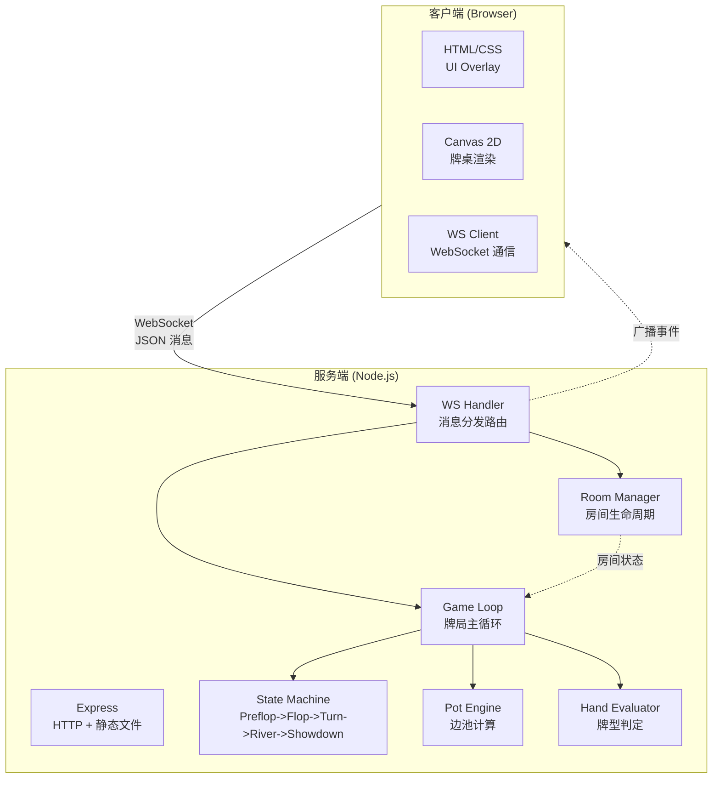
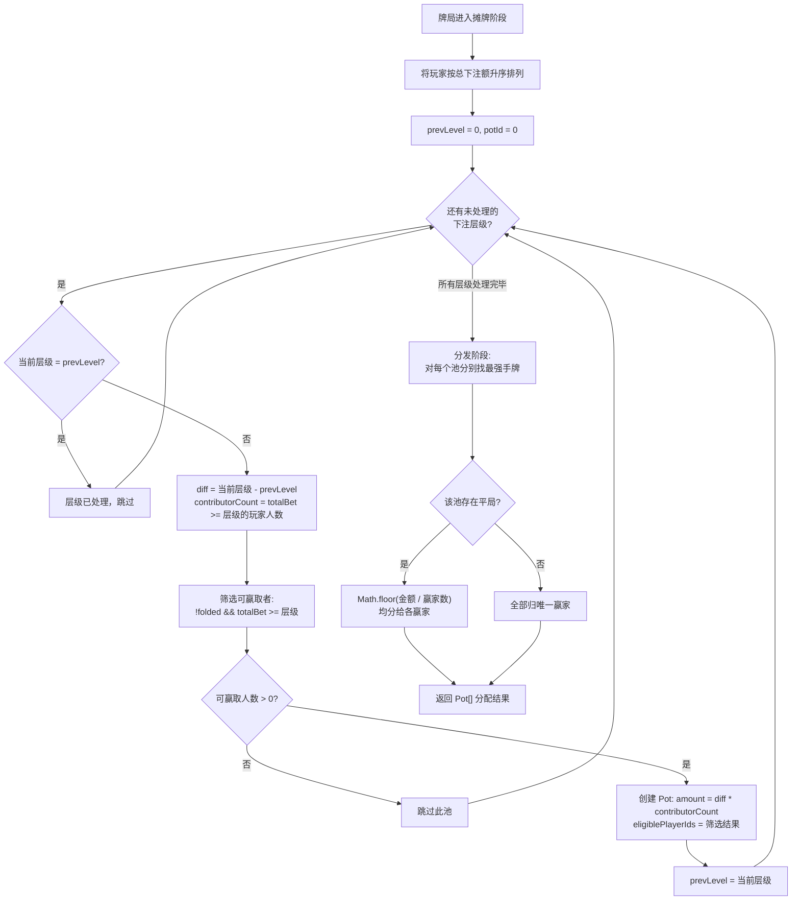
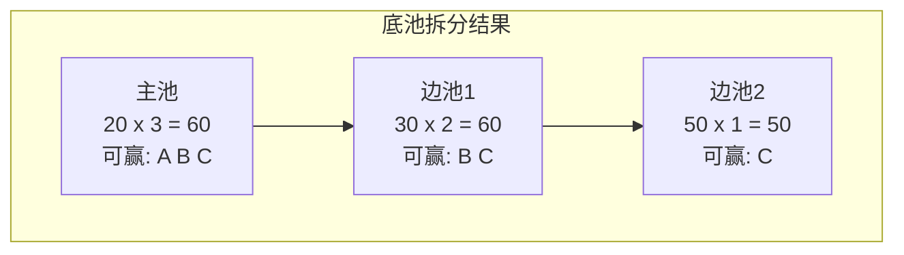

# 朋友局德州扑克 — 设计文档

## 应用类型

WebSocket 实时多人联机游戏。纯前端渲染 + Node.js 服务端权威状态管理，非营销页面，非单机应用。

## 平台与适配

### 手机端（移动优先）

- **微信浏览器**为第一优先级目标，兼容 iOS Safari 和 Android 系统浏览器
- 纵向竖屏布局，牌桌俯视缩放适配
- 底部固定栏包含操作按钮 + 道具入口（图标为主，辅以文字标签）
- 玩家分布：上方和两侧紧凑排列头像，自己的手牌在座位上方放大显示
- 道具使用流程：点击道具图标 -> 屏幕弹出目标选择浮层 -> 点击目标玩家头像确认
- 角色形象尺寸 >= 48x48px
- 所有交互按钮触控区域 >= 44x44px（微信浏览器触控友好）
- 防止页面滚动（touchmove 阻止默认行为），避免游戏过程中误滑动
- viewport meta 设置：`width=device-width, initial-scale=1.0, maximum-scale=1.0, user-scalable=no`

### 桌面端（PC）

- 横向宽屏布局（>= 1024px），牌桌居中
- 玩家座位围绕牌桌环形分布：底边为自己，其余座位按加入顺序逆时针排列
- 鼠标悬停显示玩家昵称和积分
- 操作按钮（Fold/Check/Call/Raise/All-in）在底边自己座位上方
- 道具栏在屏幕底部横向排布
- 行动历史在右侧面板纵向滚动

## 界面设计约束

### 视觉风格

- **调性**：轻松、卡通、桌游夜氛围
- **主色调**：木色（桌面）、暖白（背景）、彩色点缀
- **字体**：圆润无衬线字体（如 Noto Sans SC 或系统圆体）
- **牌背**：涂鸦式图案，不使用传统红色菱形牌背
- **桌面**：木质纹理或暖色圆桌，不使用绿色毡面
- **计分**：彩色塑料感圆片或数字标记，不使用筹码堆

### 禁止的设计元素

| 禁止 | 原因 |
|------|------|
| 绿色毡面桌布 | 赌场联想 |
| 金边、金色装饰 | 赌场联想 |
| 筹码堆（圆形筹码片） | 赌场联想 |
| 赌场纹样（菱形、四叶草） | 赌场联想 |
| 深红/暗金配色 | 赌场联想 |
| 扑克牌背红色菱形 | 赌场联想 |
| "押注""下注""彩池"等文字 | 替换为"加注""奖池" |

### 允许的元素

- 木质桌面纹理（暖色、圆桌形）
- 彩色塑料圆片形状的得分标记
- 涂鸦或插画风格的牌背
- 卡通人物形象
- 明亮彩色的操作按钮

### 角色形象区域约束

- 每个角色位于座位后方或侧方，半身像展示（头 + 上身 + 手）
- 尺寸：桌面端 >= 80x80px，手机端 >= 48x48px
- 待机动画（呼吸式上下浮动、眨眼、偶尔小动作）
- 被道具命中时触发受击动画（后仰、摇晃、表情变化）
- 蛋液效果覆盖在形象上方（z-index 高于角色但低于手牌展示区）
- 道具飞行路径起点为使用者角色胸前，终点为目标角色胸前
- 飞行曲线使用贝塞尔路径

### 道具效果视觉规格

| 道具 | 飞行 | 命中 | 持续 |
|------|------|------|------|
| 鸡蛋 | 旋转弧线，0.6s | 碎裂 + 蛋液四溅 + 黏稠流动 | 到该局结束 |
| 鲜花 | 柔和曲线，花瓣飘落，0.8s | 花瓣炸开飘散 + 喝彩文字 | 花瓣消散 3s，文字 2s |

- 动画允许用户点击跳过
- 十连发间隔 0.3s，依次飞行不等待前一个完全消失

### 牌桌布局（桌面端）

```
        [玩家3]
   [玩家2]    [玩家4]
      [公共牌区]
   [玩家1]    [玩家5]
        [玩家6/自己]
          [操作区]
     [道具栏]
```

- 公共牌区居中，5 张牌横向排列
- 玩家手牌在自己座位前方水平展开，他人手牌显示牌背
- 行动历史在屏幕右侧纵向滚动
- 牌型参考表以按钮呼出的浮层展示

### 牌桌布局（手机端）

- 牌桌缩放至屏幕宽度，俯视角度
- 角色以小型头像分布在牌桌边缘
- 我的手牌在底部始终放大显示
- 操作按钮在底部固定栏（折叠/展开模式）
- 道具入口在操作栏旁边通过图标进入
- 行动历史折叠到底部抽屉或侧边

### 交互响应

- 操作按钮点击即刻响应，不等待动画
- 计分变动：数字跳动动画，持续 0.3s
- 出牌：卡牌滑入动画，持续 0.25s
- 道具飞行：0.6-0.8s，命中动画 0.4s
- 全部动画可一键跳过（Space 键或跳过按钮）

## 色彩系统

```
牌桌背景:  #C89B5E (暖木色)
牌桌边框:  #8B6914 (深木色)
按钮主色:  #FF6B6B (珊瑚红)
确认按钮:  #4ECDC4 (青绿)
警告按钮:  #FFE66D (明黄)
文字主色:  #2C2C2C
文字辅助:  #666666
卡牌白色:  #FEFEFE
背景底色:  #FFF8E7 (暖白)
积分正:    #2ECC71 (草绿)
积分负:    #E74C3C (红)
```

## 音效规格

- 每个道具飞行和命中各有独立音效（短 MP3/OGG，<= 2s）
- 道具使用失败（积分不足）有拒绝音效
- 音效资源通过 CDN 加载或 base64 内联
- 开局、发牌、转牌圈切换有简单音效提示

## 技术栈约束

### 服务端
- **运行时**：Node.js >= 18
- **Web 框架**：Express（静态文件服务）
- **WebSocket**：`ws` 库
- **无数据库**：所有游戏状态在内存中管理
- **无身份认证**：房间码 + 昵称即可进入

### 客户端
- **渲染引擎**：PixiJS 8（通过 CDN 加载，Canvas 渲染）
- **HTML/CSS**：标准 HTML5 + CSS3，用于 UI overlay
- **通信**：原生 WebSocket API
- **音效**：Web Audio API + AudioContext

### 构建与依赖
- 服务端依赖（Express、ws）通过 `npm install` 管理
- 前端 PixiJS 通过 CDN `<script>` 标签加载
- 无需 webpack/vite 等构建工具
- 服务端代码使用 CommonJS 模块

### 部署
- Express 监听 3000 端口（或环境变量 `PORT`）
- `node server/index.js` 启动
- 客户端通过 `http://<服务器公网IP>:3000` 访问
- 无需域名或备案

## 游戏状态流转

### 房间生命周期

```
Lobby -> [创建房间 / 加入房间] -> Room(Waiting) -> [房主开始游戏] -> Playing
                                                         |
                                                    [牌局循环]
                                                         |
                                                    [仅剩一人] -> GameOver -> [重新开始] -> Room(Waiting)
```

### 单局牌局循环

```
NewHand -> Preflop -> Flop -> Turn -> River -> Showdown -> Pot分配 -> [还有人] -> NewHand
                                                                   -> [仅剩一人] -> GameOver
```

每个阶段由服务端 game-state 状态机管理，客户端监听事件驱动 UI 更新。

## 数据模型概要

### 服务端状态

```javascript
// 服务端 Room
Room {
  code: string           // 4 位数字房间码
  hostId: string         // 房主 playerId
  players: Player[]
  phase: "waiting" | "playing" | "gameover"
  hand: Hand | null
  settings: RoomSettings
  createdAt: number
}

RoomSettings {
  initialScore: 2000
  smallBlind: 10
  bigBlind: 20
  autoUpgradeBlinds: boolean
  maxPlayers: 6
}

Player {
  id: string
  nickname: string
  avatarId: number
  score: number
  isHost: boolean
  isReady: boolean
  isConnected: boolean
  // 牌局时
  cards: Card[]
  folded: boolean
  allIn: boolean
  currentBet: number
  totalBetThisHand: number
}

Hand {
  id: string
  phase: "preflop" | "flop" | "turn" | "river" | "showdown"
  deck: Card[]
  communityCards: Card[]
  players: Player[]
  pots: Pot[]
  dealerIndex: number
  currentPlayerIndex: number
  currentBet: number
  minRaise: number
  lastRaise: number
  actions: Action[]
  startTime: number
}
```

### 客户端状态

```javascript
ClientState {
  connection: "disconnected" | "connecting" | "connected"
  room: Room | null
  me: { playerId, nickname, avatarId }
  myCards: Card[]
  game: {
    phase: string
    communityCards: Card[]
    players: Player[]
    pots: Pot[]
    actionHistory: Action[]
    myTurn: boolean
    availableActions: ActionType[]
    currentPlayerId: string
    dealerIndex: number
  }
  ui: {
    showActionHistory: boolean
    showHandRef: boolean
    selectingItemTarget: boolean
    selectedItem: ItemType | null
    animations: AnimationQueue[]
  }
}
```

### 通用类型

```javascript
Card {
  suit: "hearts" | "diamonds" | "clubs" | "spades"
  rank: 2-14 (11=J, 12=Q, 13=K, 14=A)
}

Action {
  playerId: string
  type: "fold" | "check" | "call" | "raise" | "allin"
  amount: number
  timestamp: number
}

Pot {
  id: number
  amount: number
  eligiblePlayerIds: string[]
  winnerId: string | null
}

ItemType: "egg" | "flower"
```

## 多人模式与 WebSocket 通信

### 通信架构



- **服务器权威（Server Authoritative）**：所有牌局逻辑在服务端计算
- 客户端发送操作指令，服务器验证合法性、执行状态转换、广播状态更新
- 客户端不直接修改游戏状态，只响应服务端推送的事件
### 房间流程

1. 玩家 A 打开页面 -> 输入昵称 -> 点击"创建房间" -> 获得 4 位房间码
2. 玩家 B/C 输入昵称 -> 输入房间码 -> 加入房间
3. 房主在房间内管理玩家、设置默认形象
4. 房主点击"开始游戏" -> 服务端发牌
5. 每局结束后继续下一局，直到有人被淘汰

### 网络保障

- WebSocket 心跳：每 10s ping/pong，30s 无响应视为掉线
- 掉线策略：自动 Fold 当前手牌，保留积分等待重连
- 重连：昵称 + 房间码作为凭证，重连后恢复状态

### 通信协议

所有 WebSocket 消息为 JSON 格式：

```javascript
// 客户端 -> 服务端
{ type: "create_room",   data: { nickname, avatarId, roomSettings } }
{ type: "join_room",     data: { roomCode, nickname, avatarId } }
{ type: "player_action", data: { action: "fold"|"check"|"call"|"raise"|"allin", amount } }
{ type: "use_item",      data: { itemType: "egg"|"flower", targetPlayerId, count: 1|10 } }
{ type: "start_game",    data: {} }
{ type: "ready",         data: {} }
{ type: "ping",          data: {} }

// 服务端 -> 客户端
{ type: "room_joined",   data: { roomCode, players, you: playerId, isHost } }
{ type: "game_started",  data: { handId, dealerIndex, blinds } }
{ type: "hand_dealt",    data: { yourCards, communityCards, pot, players } }
{ type: "player_turn",   data: { playerId, availableActions, timeLimitMs } }
{ type: "action_result", data: { playerId, action, amount, pots, players, communityCards } }
{ type: "round_advanced",data: { round, communityCards, pot } }
{ type: "showdown",      data: { hands: [{playerId, cards, handRank}], winnerIds, potDistributions } }
{ type: "hand_end",      data: { winnerIds, scoreChanges } }
{ type: "item_anim",     data: { fromPlayerId, toPlayerId, itemType, count } }
{ type: "player_reconnect", data: { playerId, state } }
{ type: "player_disconnected", data: { playerId } }
{ type: "error",         data: { code, message } }
{ type: "pong",          data: {} }
```

## 无障碍

- 所有操作按钮有文字标签
- 颜色不作为唯一传达信息的手段
- 动画优先 `prefers-reduced-motion`
- 键盘可用 Tab / Enter / Space 操作

## 性能目标

- 首次加载时间 <= 3s（微信浏览器下载环境）
- 动画帧率 >= 30fps（PixiJS Canvas 渲染）
- 道具飞行不阻塞主线程操作
- WebSocket 消息延迟 < 200ms（同区域服务器）

## 本地化

- V1 全简体中文
- 预留 i18n 数据结构，后续可扩展英文

## 测试策略

- 服务端牌局逻辑（牌型、边池）用 Node.js 单元测试
- 客户端渲染通过手动在浏览器中验证
- WebSocket 通信用多标签页手动测试

## 边池计算流程

### 算法流程



### 三级边池示例

以 3 名玩家下注为例，演示边池拆分逻辑：

- 玩家 A：All-in 20 分
- 玩家 B：Call 50 分
- 玩家 C：Raise 到 100 分



> 注意：已弃牌的玩家虽不参与赢取池子，但其下注会计入该层级的 contributorCount。

## 文件组织

```
E:\WXdp\
  server/                 # Node.js 服务端
    index.js              # Express + WS 启动入口
    game-engine/
      deck.js             # 牌组、发牌
      hand-eval.js        # 牌型判定和比较
      pot.js              # 底池/边池计算
      game-state.js       # 牌局状态机
      room.js             # 房间管理
    ws/
      handler.js          # WebSocket 消息分发
      protocol.js         # 消息类型定义
  public/                 # 前端静态文件
    index.html            # 游戏入口页面
    css/
      style.css           # 所有 CSS
    js/
      main.js             # 入口：PixiJS + WebSocket 初始化
      game-client.js      # 客户端游戏状态管理
      ws-client.js        # WebSocket 连接和消息处理
      renderer/
        pixi-setup.js     # PixiJS 应用初始化
        table.js          # 牌桌绘制
        cards.js          # 卡牌渲染
        avatars.js        # 角色形象（待机、受击）
        items.js          # 道具飞行动画
        ui-overlay.js     # HTML/CSS UI overlay
      sound.js            # 音效管理
    assets/
      sprites/            # 贴图资源
      sounds/             # 音效文件
  package.json
  .gitignore
```

> 客户端 JS 通过 `<script>` 标签顺序加载，不使用模块打包器。PixiJS 8 通过 CDN 引入。
